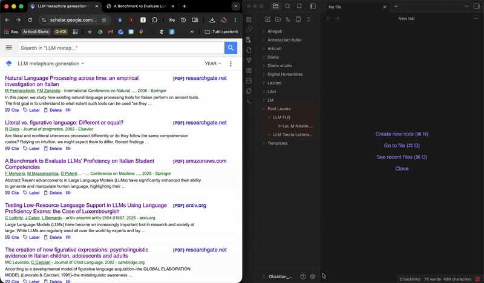

# Scholar to Obsidian Exporter

A simple and effective Chrome extension to export Google Scholar highlights directly into Markdown format, ready for **Obsidian**.

## Features

* **Automatic Extraction:** Detects Title, Authors, and all highlights from the Scholar sidebar.
* **Smart Formatting:**
    * Converts page numbers to H2 headers.
    * Uses Blockquotes (`>`) for highlighted text.
    * Detects personal notes and formats them as `### Annotation`.
* **Clean Filename:** Automatically generates files named `[Authors]. [Title].md`, replacing illegal characters (like `:` or `/`) for maximum file system compatibility.

## Installation

Since this extension is not available on the Chrome Web Store, you can install it manually in developer mode:

1.  Clone or download this repository.
2.  Open Chrome and navigate to `chrome://extensions`.
3.  Enable **Developer mode** (toggle in the top right corner).
4.  Click on **Load unpacked**.
5.  Select this project's folder.

## How to Use

1.  Go to Google Scholar (e.g., "My Library").
2.  Click on an article to open the **Highlights** sidebar panel.
3.  Click the **Scholar to Obsidian** extension icon in your browser toolbar.
4.  Click on **Download .md**.
5.  Move the downloaded file into your Obsidian Vault!

## Technologies

* HTML/CSS/JavaScript
* Chrome Extensions Manifest V3

---
*Created by [swagtoast](https://github.com/swagtoast)*